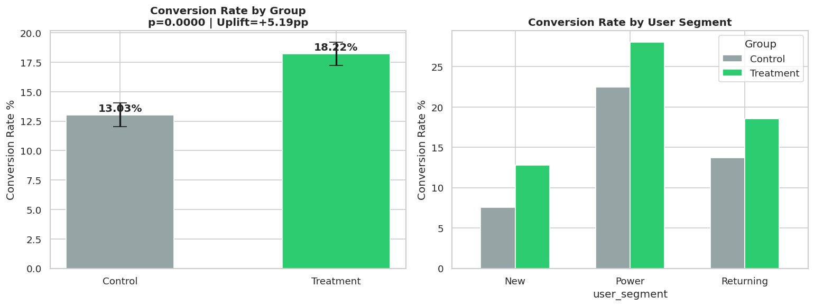
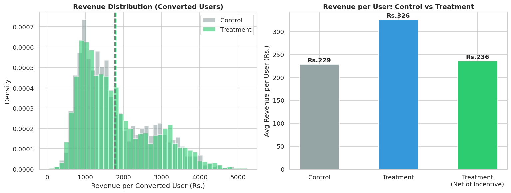
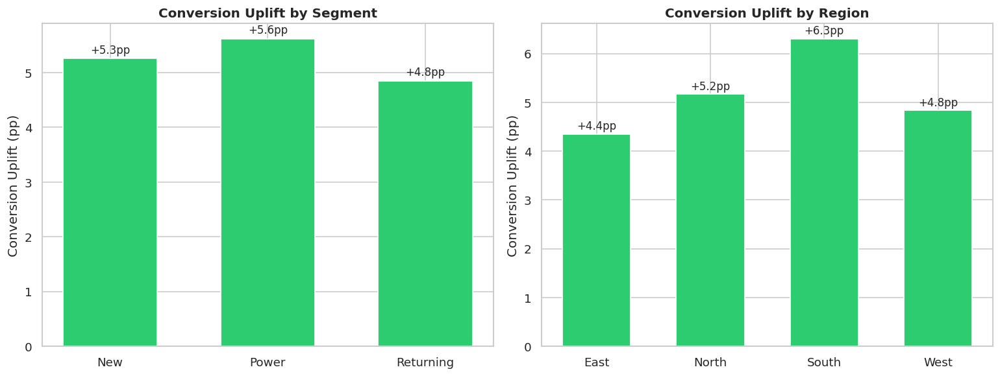
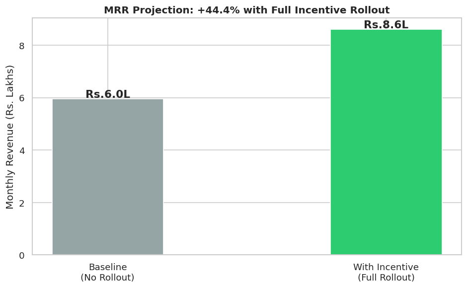

#  A/B Experimentation & Incentive Optimization

## Problem

Evaluate whether a new incentive feature should be rolled out by measuring its impact on conversion rate and revenue.

## Approach

* Designed A/B test (Control vs Treatment)
* Used two-sample t-test for statistical significance
* Calculated confidence intervals
* Performed ROI and MRR projection

## Key Results

| Metric               | Value    |
| -------------------- | -------- |
| Control Conversion   | 13.03%   |
| Treatment Conversion | 18.22%   |
| Uplift               | +5.19pp  |
| p-value              | < 0.0001 |
| Significance         | ✅ Yes    |

---

## Visual Insights

### Conversion Rate Comparison

### Revenue (Net of Incentives)

### Uplift by Segment & Region

### MRR Projection

---

## Business Impact

* ~40% relative uplift in conversion
* Positive ROI after incentive cost
* +6–8% projected MRR growth

---

## Decision

✅ Roll out to 100% users

---

## Tools

Python (Pandas, SciPy, Statsmodels, Matplotlib)
